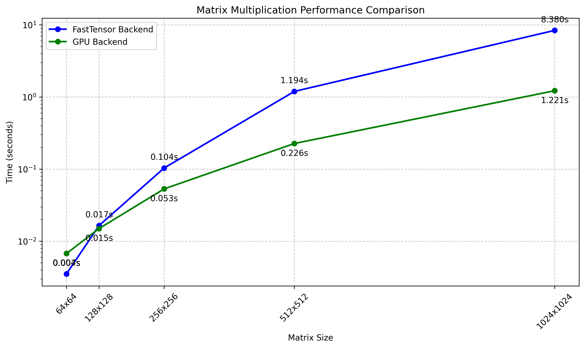

# MiniTorch Module 3


* Docs: https://minitorch.github.io/

* Overview: https://minitorch.github.io/module3.html


You will need to modify `tensor_functions.py` slightly in this assignment.

* Tests:

```
python run_tests.py
```

* Note:

Several of the tests for this assignment will only run if you are on a GPU machine and will not
run on github's test infrastructure. Please follow the instructions to setup up a colab machine
to run these tests.

This assignment requires the following files from the previous assignments. You can get these by running

```bash
python sync_previous_module.py previous-module-dir current-module-dir
```

The files that will be synced are:

        minitorch/tensor_data.py minitorch/tensor_functions.py minitorch/tensor_ops.py minitorch/operators.py minitorch/scalar.py minitorch/scalar_functions.py minitorch/module.py minitorch/autodiff.py minitorch/module.py project/run_manual.py project/run_scalar.py project/run_tensor.py minitorch/operators.py minitorch/module.py minitorch/autodiff.py minitorch/tensor.py minitorch/datasets.py minitorch/testing.py minitorch/optim.py


# Parallel Check
```
MAP
OMP: Info #276: omp_set_nested routine deprecated, please use omp_set_max_active_levels instead.

================================================================================
 Parallel Accelerator Optimizing:  Function tensor_map.<locals>._map,
/Users/zzy/Desktop/CS5781/mod3-zhubzy/minitorch/fast_ops.py (163)
================================================================================


Parallel loop listing for  Function tensor_map.<locals>._map, /Users/zzy/Desktop/CS5781/mod3-zhubzy/minitorch/fast_ops.py (163)
-----------------------------------------------------------------------------|loop #ID
    def _map(                                                                |
        out: Storage,                                                        |
        out_shape: Shape,                                                    |
        out_strides: Strides,                                                |
        in_storage: Storage,                                                 |
        in_shape: Shape,                                                     |
        in_strides: Strides,                                                 |
    ) -> None:                                                               |
      # Check if tensors are stride-aligned for fast path                    |
        is_aligned = True                                                    |
        for i in range(len(out_shape)):                                      |
            if (out_strides[i] != in_strides[i] or                           |
                out_shape[i] != in_shape[i]):                                |
                is_aligned = False                                           |
                break                                                        |
                                                                             |
        if is_aligned:                                                       |
            # Main parallel loop if stride-aligned                           |
            for i in prange(out.size):---------------------------------------| #0
                out[i] = fn(in_storage[i])                                   |
        else:                                                                |
            # Main parallel loop                                             |
            for i in prange(out.size):---------------------------------------| #1
                # All indices use numpy buffers                              |
                out_index = np.empty(MAX_DIMS, np.int32)                     |
                in_index = np.empty(MAX_DIMS, np.int32)                      |
                to_index(i, out_shape, out_index)                            |
                broadcast_index(out_index, out_shape, in_shape, in_index)    |
                in_position = index_to_position(in_index, in_strides)        |
                out_position = index_to_position(out_index, out_strides)     |
                out[out_position] = fn(in_storage[in_position])              |
--------------------------------- Fusing loops ---------------------------------
Attempting fusion of parallel loops (combines loops with similar properties)...
Following the attempted fusion of parallel for-loops there are 2 parallel for-
loop(s) (originating from loops labelled: #0, #1).
--------------------------------------------------------------------------------
----------------------------- Before Optimisation ------------------------------
--------------------------------------------------------------------------------
------------------------------ After Optimisation ------------------------------
Parallel structure is already optimal.
--------------------------------------------------------------------------------
--------------------------------------------------------------------------------

---------------------------Loop invariant code motion---------------------------
Allocation hoisting:
The memory allocation derived from the instruction at
/Users/zzy/Desktop/CS5781/mod3-zhubzy/minitorch/fast_ops.py (187) is hoisted out
 of the parallel loop labelled #1 (it will be performed before the loop is
executed and reused inside the loop):
   Allocation:: out_index = np.empty(MAX_DIMS, np.int32)
    - numpy.empty() is used for the allocation.
The memory allocation derived from the instruction at
/Users/zzy/Desktop/CS5781/mod3-zhubzy/minitorch/fast_ops.py (188) is hoisted out
 of the parallel loop labelled #1 (it will be performed before the loop is
executed and reused inside the loop):
   Allocation:: in_index = np.empty(MAX_DIMS, np.int32)
    - numpy.empty() is used for the allocation.
None
ZIP

================================================================================
 Parallel Accelerator Optimizing:  Function tensor_zip.<locals>._zip,
/Users/zzy/Desktop/CS5781/mod3-zhubzy/minitorch/fast_ops.py (222)
================================================================================


Parallel loop listing for  Function tensor_zip.<locals>._zip, /Users/zzy/Desktop/CS5781/mod3-zhubzy/minitorch/fast_ops.py (222)
---------------------------------------------------------------------------------|loop #ID
    def _zip(                                                                    |
        out: Storage,                                                            |
        out_shape: Shape,                                                        |
        out_strides: Strides,                                                    |
        a_storage: Storage,                                                      |
        a_shape: Shape,                                                          |
        a_strides: Strides,                                                      |
        b_storage: Storage,                                                      |
        b_shape: Shape,                                                          |
        b_strides: Strides,                                                      |
    ) -> None:                                                                   |
                                                                                 |
                                                                                 |
        # Check if tensors are stride-aligned (moved outside parallel region)    |
        is_aligned = True                                                        |
        for i in range(len(out_shape)):                                          |
            if (out_strides[i] != a_strides[i] or                                |
                out_strides[i] != b_strides[i] or                                |
                out_shape[i] != a_shape[i] or                                    |
                out_shape[i] != b_shape[i]):                                     |
                is_aligned = False                                               |
                break                                                            |
                                                                                 |
        if is_aligned:                                                           |
            # Main parallel loop if stride-aligned                               |
            for i in prange(len(out)):-------------------------------------------| #2
                out[i] = fn(a_storage[i], b_storage[i])                          |
        else:                                                                    |
        # Main parallel loop                                                     |
            for i in prange(len(out)):     --------------------------------------| #3
                # All indices use numpy buffers                                  |
                out_index = np.empty(MAX_DIMS, dtype=np.int32)                   |
                a_index = np.empty(MAX_DIMS, dtype=np.int32)                     |
                b_index = np.empty(MAX_DIMS, dtype=np.int32)                     |
                to_index(i, out_shape, out_index)                                |
                broadcast_index(out_index, out_shape, a_shape, a_index)          |
                broadcast_index(out_index, out_shape, b_shape, b_index)          |
                j = index_to_position(a_index, a_strides)                        |
                k = index_to_position(b_index, b_strides)                        |
                out[i] = fn(a_storage[j], b_storage[k])                          |
--------------------------------- Fusing loops ---------------------------------
Attempting fusion of parallel loops (combines loops with similar properties)...
Following the attempted fusion of parallel for-loops there are 2 parallel for-
loop(s) (originating from loops labelled: #2, #3).
--------------------------------------------------------------------------------
----------------------------- Before Optimisation ------------------------------
--------------------------------------------------------------------------------
------------------------------ After Optimisation ------------------------------
Parallel structure is already optimal.
--------------------------------------------------------------------------------
--------------------------------------------------------------------------------

---------------------------Loop invariant code motion---------------------------
Allocation hoisting:
The memory allocation derived from the instruction at
/Users/zzy/Desktop/CS5781/mod3-zhubzy/minitorch/fast_ops.py (253) is hoisted out
 of the parallel loop labelled #3 (it will be performed before the loop is
executed and reused inside the loop):
   Allocation:: out_index = np.empty(MAX_DIMS, dtype=np.int32)
    - numpy.empty() is used for the allocation.
The memory allocation derived from the instruction at
/Users/zzy/Desktop/CS5781/mod3-zhubzy/minitorch/fast_ops.py (254) is hoisted out
 of the parallel loop labelled #3 (it will be performed before the loop is
executed and reused inside the loop):
   Allocation:: a_index = np.empty(MAX_DIMS, dtype=np.int32)
    - numpy.empty() is used for the allocation.
The memory allocation derived from the instruction at
/Users/zzy/Desktop/CS5781/mod3-zhubzy/minitorch/fast_ops.py (255) is hoisted out
 of the parallel loop labelled #3 (it will be performed before the loop is
executed and reused inside the loop):
   Allocation:: b_index = np.empty(MAX_DIMS, dtype=np.int32)
    - numpy.empty() is used for the allocation.
None
REDUCE

================================================================================
 Parallel Accelerator Optimizing:  Function tensor_reduce.<locals>._reduce,
/Users/zzy/Desktop/CS5781/mod3-zhubzy/minitorch/fast_ops.py (287)
================================================================================


Parallel loop listing for  Function tensor_reduce.<locals>._reduce, /Users/zzy/Desktop/CS5781/mod3-zhubzy/minitorch/fast_ops.py (287)
-----------------------------------------------------------------------|loop #ID
    def _reduce(                                                       |
        out: Storage,                                                  |
        out_shape: Shape,                                              |
        out_strides: Strides,                                          |
        a_storage: Storage,                                            |
        a_shape: Shape,                                                |
        a_strides: Strides,                                            |
        reduce_dim: int,                                               |
    ) -> None:                                                         |
                                                                       |
                                                                       |
        size = len(out)                                                |
        reduce_stride = a_strides[reduce_dim]                          |
                                                                       |
        for out_pos in prange(size):-----------------------------------| #4
            # Outer loop: calculate indices                            |
            out_index = np.empty(MAX_DIMS, np.int32)                   |
            to_index(out_pos, out_shape, out_index)                    |
            base_position = index_to_position(out_index, a_strides)    |
                                                                       |
            # Inner loop: only local variables and operations          |
            val = out[out_pos]                                         |
            pos = base_position                                        |
            for i in range(a_shape[reduce_dim]):                       |
                val = fn(val, a_storage[pos])                          |
                pos += reduce_stride                                   |
                                                                       |
            out[out_pos] = val                                         |
--------------------------------- Fusing loops ---------------------------------
Attempting fusion of parallel loops (combines loops with similar properties)...
Following the attempted fusion of parallel for-loops there are 1 parallel for-
loop(s) (originating from loops labelled: #4).
--------------------------------------------------------------------------------
----------------------------- Before Optimisation ------------------------------
--------------------------------------------------------------------------------
------------------------------ After Optimisation ------------------------------
Parallel structure is already optimal.
--------------------------------------------------------------------------------
--------------------------------------------------------------------------------

---------------------------Loop invariant code motion---------------------------
Allocation hoisting:
The memory allocation derived from the instruction at
/Users/zzy/Desktop/CS5781/mod3-zhubzy/minitorch/fast_ops.py (303) is hoisted out
 of the parallel loop labelled #4 (it will be performed before the loop is
executed and reused inside the loop):
   Allocation:: out_index = np.empty(MAX_DIMS, np.int32)
    - numpy.empty() is used for the allocation.
None
MATRIX MULTIPLY

================================================================================
 Parallel Accelerator Optimizing:  Function _tensor_matrix_multiply,
/Users/zzy/Desktop/CS5781/mod3-zhubzy/minitorch/fast_ops.py (319)
================================================================================


Parallel loop listing for  Function _tensor_matrix_multiply, /Users/zzy/Desktop/CS5781/mod3-zhubzy/minitorch/fast_ops.py (319)
--------------------------------------------------------------------------------------------------------------------------------------------------------------------|loop #ID
def _tensor_matrix_multiply(                                                                                                                                        |
    out: Storage,                                                                                                                                                   |
    out_shape: Shape,                                                                                                                                               |
    out_strides: Strides,                                                                                                                                           |
    a_storage: Storage,                                                                                                                                             |
    a_shape: Shape,                                                                                                                                                 |
    a_strides: Strides,                                                                                                                                             |
    b_storage: Storage,                                                                                                                                             |
    b_shape: Shape,                                                                                                                                                 |
    b_strides: Strides,                                                                                                                                             |
) -> None:                                                                                                                                                          |
    """NUMBA tensor matrix multiply function.                                                                                                                       |
                                                                                                                                                                    |
    Should work for any tensor shapes that broadcast as long as                                                                                                     |
                                                                                                                                                                    |
    ```                                                                                                                                                             |
    assert a_shape[-1] == b_shape[-2]                                                                                                                               |
    ```                                                                                                                                                             |
                                                                                                                                                                    |
    Optimizations:                                                                                                                                                  |
                                                                                                                                                                    |
    * Outer loop in parallel                                                                                                                                        |
    * No index buffers or function calls                                                                                                                            |
    * Inner loop should have no global writes, 1 multiply.                                                                                                          |
                                                                                                                                                                    |
                                                                                                                                                                    |
    Args:                                                                                                                                                           |
    ----                                                                                                                                                            |
        out (Storage): storage for `out` tensor                                                                                                                     |
        out_shape (Shape): shape for `out` tensor                                                                                                                   |
        out_strides (Strides): strides for `out` tensor                                                                                                             |
        a_storage (Storage): storage for `a` tensor                                                                                                                 |
        a_shape (Shape): shape for `a` tensor                                                                                                                       |
        a_strides (Strides): strides for `a` tensor                                                                                                                 |
        b_storage (Storage): storage for `b` tensor                                                                                                                 |
        b_shape (Shape): shape for `b` tensor                                                                                                                       |
        b_strides (Strides): strides for `b` tensor                                                                                                                 |
                                                                                                                                                                    |
    Returns:                                                                                                                                                        |
    -------                                                                                                                                                         |
        None : Fills in `out`                                                                                                                                       |
                                                                                                                                                                    |
    """                                                                                                                                                             |
                                                                                                                                                                    |
                                                                                                                                                                    |
                                                                                                                                                                    |
                                                                                                                                                                    |
    a_rows = a_shape[-2]                                                                                                                                            |
    a_cols = a_shape[-1]                                                                                                                                            |
    b_cols = b_shape[-1]                                                                                                                                            |
    a_batch_stride = a_strides[0] if a_shape[0] > 1 else 0                                                                                                          |
    b_batch_stride = b_strides[0] if b_shape[0] > 1 else 0                                                                                                          |
    out_batch_stride = out_strides[0] if out_shape[0] > 1 else 0                                                                                                    |
                                                                                                                                                                    |
                                                                                                                                                                    |
    # Handle batch dimensions with parallel outer loop                                                                                                              |
    for batch in prange(max(1, out_shape[0])):----------------------------------------------------------------------------------------------------------------------| #8
        # Calculate base offsets for this batch                                                                                                                     |
        a_batch_offset = batch * a_batch_stride                                                                                                                     |
        b_batch_offset = batch * b_batch_stride                                                                                                                     |
        out_batch_offset = batch * out_batch_stride                                                                                                                 |
                                                                                                                                                                    |
        # Core matrix multiplication for this batch                                                                                                                 |
        for i in prange(a_rows):------------------------------------------------------------------------------------------------------------------------------------| #7
            for j in prange(b_cols):--------------------------------------------------------------------------------------------------------------------------------| #6
                # Initialize sum for dot product                                                                                                                    |
                acc = 0.0                                                                                                                                           |
                # Single inner loop for dot product between row of A and column of B                                                                                |
                for k in prange(a_cols):----------------------------------------------------------------------------------------------------------------------------| #5
                    acc += a_storage[a_batch_offset + i * a_strides[-2] + k * a_strides[-1]] * b_storage[b_batch_offset + k * b_strides[-2] + j * b_strides[-1]]    |
                                                                                                                                                                    |
                out[out_batch_offset + i * out_strides[-2] + j * out_strides[-1]] = acc                                                                             |
--------------------------------- Fusing loops ---------------------------------
Attempting fusion of parallel loops (combines loops with similar properties)...
Following the attempted fusion of parallel for-loops there are 2 parallel for-
loop(s) (originating from loops labelled: #8, #7).
--------------------------------------------------------------------------------
---------------------------- Optimising loop nests -----------------------------
Attempting loop nest rewrites (optimising for the largest parallel loops)...

+--8 is a parallel loop
   +--7 --> rewritten as a serial loop
      +--6 --> rewritten as a serial loop
         +--5 --> rewritten as a serial loop
--------------------------------------------------------------------------------
----------------------------- Before Optimisation ------------------------------
Parallel region 0:
+--8 (parallel)
   +--7 (parallel)
      +--6 (parallel)
         +--5 (parallel)


--------------------------------------------------------------------------------
------------------------------ After Optimisation ------------------------------
Parallel region 0:
+--8 (parallel)
   +--7 (serial)
      +--6 (serial)
         +--5 (serial)


Parallel region 0 (loop #8) had 0 loop(s) fused and 3 loop(s) serialized as part
 of the larger parallel loop (#8).
--------------------------------------------------------------------------------
--------------------------------------------------------------------------------

---------------------------Loop invariant code motion---------------------------
Allocation hoisting:
No allocation hoisting found
```

# Matmul performance




# Training

### Split (Running on M1 pro)
```
(base) (.venv) zzy@Zachs-MacBook-Pro mod3-zhubzy % python  project/run_fast_tensor.py --BACKEND cpu --HIDDEN 100 --DATASET split --RATE 0.04
OMP: Info #276: omp_set_nested routine deprecated, please use omp_set_max_active_levels instead.
Epoch  0  loss  5.654978760980882 correct 35
Time  7.084343910217285
Epoch  10  loss  2.7662637879473046 correct 42
Time  0.06436395645141602
Epoch  20  loss  2.2695642902663252 correct 44
Time  0.06461024284362793
Epoch  30  loss  2.124093587576185 correct 42
Time  0.0682370662689209
Epoch  40  loss  1.8722721651669843 correct 44
Time  0.06739997863769531
Epoch  50  loss  1.729844577854628 correct 45
Time  0.06832408905029297
Epoch  60  loss  1.6962977910080184 correct 46
Time  0.0704050064086914
Epoch  70  loss  1.532692966833259 correct 45
Time  0.06202411651611328
Epoch  80  loss  1.3146006353986076 correct 45
Time  0.06833791732788086
Epoch  90  loss  1.45207310778544 correct 45
Time  0.07681608200073242
Epoch  100  loss  1.1538811245258414 correct 49
Time  0.1645498275756836
Epoch  110  loss  1.188336409518752 correct 47
Time  0.07569384574890137
Epoch  120  loss  0.9961885977174855 correct 47
Time  0.07174992561340332
Epoch  130  loss  0.9842618257880106 correct 47
Time  0.07079815864562988
Epoch  140  loss  0.9008338500938832 correct 50
Time  0.07600688934326172
Epoch  150  loss  0.8387115792050858 correct 50
Time  0.08619427680969238
Epoch  160  loss  0.822141892613131 correct 46
Time  0.06826114654541016
Epoch  170  loss  0.6861214381559794 correct 49
Time  0.07049393653869629
Epoch  180  loss  0.8850211526043442 correct 48
Time  0.08052802085876465
Epoch  190  loss  0.7376256505811515 correct 49
Time  0.07501721382141113
Epoch  200  loss  0.7852551721205447 correct 49
Time  0.06364202499389648
Epoch  210  loss  0.6040633956620672 correct 50
Time  0.07879805564880371
Epoch  220  loss  0.563268554119321 correct 47
Time  0.08746767044067383
Epoch  230  loss  0.5174508758272623 correct 49
Time  0.09369707107543945
Epoch  240  loss  0.4857614111319829 correct 49
Time  0.07102417945861816
Epoch  250  loss  0.48359399846736535 correct 49
Time  0.07375216484069824
Epoch  260  loss  0.5209504609142986 correct 50
Time  0.19364404678344727
Epoch  270  loss  0.8035562065395776 correct 48
Time  0.11053013801574707
Epoch  280  loss  0.427419895774245 correct 49
Time  0.11304616928100586
Epoch  290  loss  0.5151967021147488 correct 49
Time  0.10803103446960449
Epoch  300  loss  0.5744063568753005 correct 47
Time  0.11842012405395508
Epoch  310  loss  0.4921296761940698 correct 50
Time  0.12329792976379395
Epoch  320  loss  0.5331160820858481 correct 50
Time  0.06521391868591309
Epoch  330  loss  0.3844260733992545 correct 50
Time  0.11047482490539551
Epoch  340  loss  0.4573925654468451 correct 50
Time  0.11349725723266602
Epoch  350  loss  0.39048874277630716 correct 50
Time  0.10952186584472656
Epoch  360  loss  0.3283699227313102 correct 49
Time  0.07077717781066895
Epoch  370  loss  0.3495472195693642 correct 50
Time  0.06808805465698242
Epoch  380  loss  0.30078434313210205 correct 50
Time  0.06714916229248047
Epoch  390  loss  0.3040959597314893 correct 49
Time  0.0641469955444336
Epoch  400  loss  0.4076027357421617 correct 50
Time  0.07624411582946777
Epoch  410  loss  0.3832657159207654 correct 50
Time  0.06606698036193848
Epoch  420  loss  0.31014826242537215 correct 50
Time  0.06345605850219727
Epoch  430  loss  0.32461970566952227 correct 50
Time  0.06995010375976562
Epoch  440  loss  0.352456283402348 correct 50
Time  0.07509183883666992
Epoch  450  loss  0.2849015698712125 correct 49
Time  0.06976008415222168
Epoch  460  loss  0.3733841403404448 correct 49
Time  0.06329822540283203
Epoch  470  loss  0.2931923135428612 correct 50
Time  0.06467723846435547
Epoch  480  loss  0.25820387022543043 correct 50
Time  0.07248210906982422
Epoch  490  loss  0.27244590590654 correct 50
Time  0.06610417366027832
```

### Simple (Running on M1 pro)
```
Epoch  0  loss  34.87092305469962 correct 33
Time  4.408928394317627

Epoch  10  loss  14.813646712322509 correct 49
Time  1.7893123626708984

Epoch  20  loss  8.675122941675799 correct 49
Time  1.3570129871368408

Epoch  30  loss  5.998256799462559 correct 49
Time  1.3585789203643799

Epoch  40  loss  4.592449582561445 correct 50
Time  1.3589248657226562

Epoch  50  loss  3.678122861718751 correct 50
Time  1.4163222312927246

Epoch  60  loss  3.166226963853044 correct 50
Time  1.7035210132598877

Epoch  70  loss  2.7509162645771736 correct 50
Time  1.3543038368225098

Epoch  80  loss  2.4883478711985703 correct 50
Time  1.3397345542907715

Epoch  90  loss  2.2384004595284925 correct 50
Time  1.4303867816925049

Epoch  100  loss  2.0876170603954347 correct 50
Time  1.7950122356414795

Epoch  110  loss  2.005764334126912 correct 50
Time  1.3825597763061523

Epoch  120  loss  1.857299336617158 correct 50
Time  1.3480517864227295

Epoch  130  loss  1.8784193396409457 correct 50
Time  1.3771674633026123

Epoch  140  loss  1.5727706208698116 correct 50
Time  1.3488337993621826

Epoch  150  loss  1.623048565335202 correct 50
Time  1.590052843093872

Epoch  160  loss  1.511966292295491 correct 50
Time  1.4661245346069336

Epoch  170  loss  1.5513588034396681 correct 50
Time  1.3858747482299805

Epoch  180  loss  1.4637588109940023 correct 50
Time  1.3785979747772217

Epoch  190  loss  1.2758670557496214 correct 50
Time  1.4057207107543945

Epoch  200  loss  1.4549922240370043 correct 50
Time  1.787015438079834

Epoch  210  loss  1.229704882877588 correct 50
Time  1.3570101261138916

Epoch  220  loss  1.2482653707118492 correct 50
Time  1.417112112045288

Epoch  230  loss  1.1267550910618789 correct 50
Time  2.111675262451172

Epoch  240  loss  1.0958635468046198 correct 50
Time  1.4241690635681152

Epoch  250  loss  1.1324463811514809 correct 50
Time  1.8236522674560547

Epoch  260  loss  1.1107440395898183 correct 50
Time  1.348405361175537

Epoch  270  loss  1.1319849357517224 correct 50
Time  1.3674225807189941

Epoch  280  loss  1.0839809173605774 correct 50
Time  1.3643033504486084

Epoch  290  loss  1.0908611818246519 correct 50
Time  1.4081242084503174

Epoch  300  loss  1.087099338482586 correct 50
Time  1.9101181030273438

Epoch  310  loss  1.0598848964424274 correct 50
Time  1.4023194313049316

Epoch  320  loss  0.8941084599064155 correct 50
Time  1.3853797912597656

Epoch  330  loss  0.9756149877535981 correct 50
Time  1.379307508468628

Epoch  340  loss  1.010528844052815 correct 50
Time  1.4837958812713623

Epoch  350  loss  0.825190667753604 correct 50
Time  1.8510925769805908

Epoch  360  loss  0.9141787221371074 correct 50
Time  1.4237303733825684

Epoch  370  loss  0.9187012304082144 correct 50
Time  1.3660564422607422

Epoch  380  loss  0.8771401186243317 correct 50
Time  1.3575551509857178

Epoch  390  loss  0.7467136814448886 correct 50
Time  1.5802502632141113

Epoch  400  loss  0.8280659244933144 correct 50
Time  1.4475607872009277

Epoch  410  loss  0.8657160299029185 correct 50
Time  1.3671092987060547

Epoch  420  loss  0.8301912377769155 correct 50
Time  1.3637936115264893

Epoch  430  loss  0.7794669303345476 correct 50
Time  1.354017972946167

Epoch  440  loss  0.671049914487873 correct 50
Time  1.5743837356567383

Epoch  450  loss  0.7472328177917137 correct 50
Time  1.5718278884887695

Epoch  460  loss  0.7512815252472349 correct 50
Time  1.4598000049591064

Epoch  470  loss  0.7559644526870601 correct 50
Time  1.454216480255127

Epoch  480  loss  0.7455268078712989 correct 50
Time  1.4485695362091064

Epoch  490  loss  0.6727929819310843 correct 50
Time  1.7860157489776611

```

### Xor (Running on M1 pro)
```
Epoch  0  loss  3.5865205603863997 correct 30
Time  7.232081174850464

Epoch  10  loss  3.1470971236164913 correct 41
Time  0.05862092971801758

Epoch  20  loss  2.9395366929390754 correct 41
Time  0.047167062759399414

Epoch  30  loss  2.7681512902998073 correct 42
Time  0.04939913749694824

Epoch  40  loss  2.563975998013602 correct 42
Time  0.047303199768066406

Epoch  50  loss  2.3480170444329547 correct 43
Time  0.04931521415710449

Epoch  60  loss  2.225389799114953 correct 46
Time  0.06046891212463379

Epoch  70  loss  2.003890525677847 correct 43
Time  0.05458402633666992

Epoch  80  loss  1.7920732913458601 correct 44
Time  0.05246710777282715

Epoch  90  loss  1.6371346000395626 correct 47
Time  0.07193112373352051

Epoch  100  loss  1.5064340174210575 correct 48
Time  0.05842709541320801

Epoch  110  loss  1.4198037741592935 correct 47
Time  0.04966282844543457

Epoch  120  loss  1.3679473801333044 correct 48
Time  0.048647165298461914

Epoch  130  loss  1.1431448514537024 correct 48
Time  0.05283617973327637

Epoch  140  loss  1.1615837023197455 correct 48
Time  0.05375385284423828

Epoch  150  loss  1.0186797460270713 correct 48
Time  0.052645206451416016

Epoch  160  loss  0.9241409063634757 correct 49
Time  0.06248021125793457

Epoch  170  loss  0.8942888663194687 correct 48
Time  0.0664820671081543

Epoch  180  loss  0.8711929644734265 correct 48
Time  0.10965561866760254

Epoch  190  loss  0.789694164420977 correct 49
Time  0.059242963790893555

Epoch  200  loss  0.8560535894197253 correct 48
Time  0.05653095245361328

Epoch  210  loss  0.6978387632990568 correct 49
Time  0.05499100685119629

Epoch  220  loss  0.6463279626961915 correct 48
Time  0.056040048599243164

Epoch  230  loss  0.6686707543913248 correct 49
Time  0.051892995834350586

Epoch  240  loss  0.5901905343450126 correct 49
Time  0.06534194946289062

Epoch  250  loss  0.6192628252197132 correct 49
Time  0.0649259090423584

Epoch  260  loss  0.5488301897549044 correct 49
Time  0.053122758865356445

Epoch  270  loss  0.530011858430844 correct 50
Time  0.08472609519958496

Epoch  280  loss  0.5196071202836114 correct 49
Time  0.07542896270751953

Epoch  290  loss  0.5054591352731796 correct 50
Time  0.06910896301269531

Epoch  300  loss  0.47525620042557837 correct 50
Time  0.05602407455444336

Epoch  310  loss  0.48513480528454417 correct 49
Time  0.07083892822265625

Epoch  320  loss  0.45022169164470205 correct 49
Time  0.06257820129394531

Epoch  330  loss  0.4372278426471408 correct 49
Time  0.06127476692199707

Epoch  340  loss  0.39999343096258044 correct 50
Time  0.05270695686340332

Epoch  350  loss  0.41922854851541197 correct 49
Time  0.05341601371765137

Epoch  360  loss  0.37446089719232956 correct 49
Time  0.08415794372558594

Epoch  370  loss  0.3660001205282969 correct 49
Time  0.06748080253601074

Epoch  380  loss  0.40172285902195776 correct 50
Time  0.06540417671203613

Epoch  390  loss  0.3587971148470915 correct 49
Time  0.056001901626586914

Epoch  400  loss  0.34102713540746415 correct 49
Time  0.10631489753723145

Epoch  410  loss  0.30884353421930866 correct 50
Time  0.13668608665466309

Epoch  420  loss  0.34496009134218836 correct 49
Time  0.07626795768737793

Epoch  430  loss  0.3407435438080767 correct 50
Time  0.055986881256103516

Epoch  440  loss  0.3105385567730499 correct 49
Time  0.05579018592834473

Epoch  450  loss  0.278159836238047 correct 50
Time  0.07543802261352539

Epoch  460  loss  0.3397653647851711 correct 50
Time  0.04808211326599121

Epoch  470  loss  0.2769475979950611 correct 50
Time  0.05095791816711426

Epoch  480  loss  0.28488943947505757 correct 50
Time  0.046447038650512695

Epoch  490  loss  0.2592262536375581 correct 50
Time  0.048644065856933594

```

### Split (Cuda running on T4)
```
Epoch  0  loss  3.1384926076832468 correct 33
Time  4.134276628494263
Epoch  10  loss  2.7243605283561905 correct 35
Time  1.3737156391143799
Epoch  20  loss  2.4928284159502944 correct 33
Time  1.3707046508789062
Epoch  30  loss  2.3735637977440575 correct 43
Time  1.713878870010376
Epoch  40  loss  1.7645568942010716 correct 44
Time  1.3844807147979736
Epoch  50  loss  1.4817267008574657 correct 46
Time  1.3785765171051025
Epoch  60  loss  1.4215970661759584 correct 46
Time  1.402282953262329
Epoch  70  loss  1.2454394481880062 correct 48
Time  1.3551123142242432
Epoch  80  loss  1.0969147007363782 correct 47
Time  1.8401472568511963
Epoch  90  loss  0.980696747880413 correct 47
Time  1.4165105819702148
Epoch  100  loss  0.9321443410800192 correct 48
Time  1.436136245727539
Epoch  110  loss  0.9015034722453978 correct 47
Time  1.3732733726501465
Epoch  120  loss  0.743809101203226 correct 48
Time  1.370556354522705
Epoch  130  loss  0.7454355404410424 correct 47
Time  2.0077431201934814
Epoch  140  loss  0.7073189916615148 correct 48
Time  1.3712921142578125
Epoch  150  loss  0.7527047920483954 correct 48
Time  1.3657023906707764
Epoch  160  loss  0.7240165301286256 correct 48
Time  1.3794848918914795
Epoch  170  loss  0.6048516825091017 correct 48
Time  1.359574556350708
Epoch  180  loss  0.6572403711367681 correct 49
Time  2.075929880142212
Epoch  190  loss  0.5617572887803409 correct 48
Time  1.3708415031433105
Epoch  200  loss  0.6465653689844039 correct 48
Time  1.364954948425293
Epoch  210  loss  0.5319666576606373 correct 49
Time  1.3513641357421875
Epoch  220  loss  0.5692061592998051 correct 49
Time  1.4182348251342773
Epoch  230  loss  0.4618108700316135 correct 49
Time  2.1561052799224854
Epoch  240  loss  0.4555122233794648 correct 49
Time  1.4459478855133057
Epoch  250  loss  0.48034141908490415 correct 49
Time  1.3719429969787598
Epoch  260  loss  0.4555810717227082 correct 48
Time  1.3791284561157227
Epoch  270  loss  0.4801902563602609 correct 49
Time  1.3712406158447266
Epoch  280  loss  0.4185735351396436 correct 49
Time  1.9357869625091553
Epoch  290  loss  0.4762782411910719 correct 49
Time  1.3552429676055908
Epoch  300  loss  0.3857647896278166 correct 48
Time  1.3685460090637207
Epoch  310  loss  0.38350143586407808 correct 49
Time  1.3741211891174316
Epoch  320  loss  0.3623835953440258 correct 49
Time  1.3748514652252197
Epoch  330  loss  0.3696639059207575 correct 49
Time  1.8626155853271484
Epoch  340  loss  0.33287932397639617 correct 49
Time  1.3792424201965332
Epoch  350  loss  0.4578047113249321 correct 49
Time  1.4445393085479736
Epoch  360  loss  0.4654515839416049 correct 49
Time  1.4536397457122803
Epoch  370  loss  0.4275922914662182 correct 48
Time  1.5478136539459229
Epoch  380  loss  0.36806461679484244 correct 50
Time  1.6907322406768799
Epoch  390  loss  0.33266007045010957 correct 49
Time  1.3561546802520752
Epoch  400  loss  0.38179453633989047 correct 50
Time  1.4045915603637695
Epoch  410  loss  0.36114261503356055 correct 49
Time  1.3562486171722412
Epoch  420  loss  0.32840762543354574 correct 49
Time  1.6746196746826172
Epoch  430  loss  0.3490976537580467 correct 49
Time  1.3744444847106934
Epoch  440  loss  0.331310822847161 correct 50
Time  1.3573658466339111
Epoch  450  loss  0.32260136602034652 correct 49
Time  1.3727030754089355
Epoch  460  loss  0.37747496442196624 correct 49
Time  1.364459753036499
Epoch  470  loss  0.27794892600806493 correct 49
Time  1.7031469345092773
Epoch  480  loss  0.24208461048678385 correct 49
Time  1.4443893432617188
Epoch  490  loss  0.5152384305272025 correct 50
Time  1.4254779815673828
```

### Xor (Cuda running on T4)
```
Epoch  0  loss  3.410347874918497 correct 28
Time  4.272539377212524
Epoch  10  loss  2.79609849446496 correct 41
Time  1.4196641445159912
Epoch  20  loss  2.517458043324409 correct 41
Time  1.3557345867156982
Epoch  30  loss  2.4061583029972166 correct 40
Time  1.8856303691864014
Epoch  40  loss  2.1169316905150907 correct 42
Time  1.3473100662231445
Epoch  50  loss  1.993585033267518 correct 43
Time  1.356959581375122
Epoch  60  loss  1.823804780104609 correct 43
Time  1.3398339748382568
Epoch  70  loss  1.7388144493285928 correct 42
Time  1.391139030456543
Epoch  80  loss  1.7323131331152503 correct 42
Time  1.9043605327606201
Epoch  90  loss  1.6174343838529644 correct 43
Time  1.409665822982788
Epoch  100  loss  1.5890874644713357 correct 43
Time  1.4098868370056152
Epoch  110  loss  1.526083351410884 correct 43
Time  1.3502919673919678
Epoch  120  loss  1.4182149808800702 correct 43
Time  1.3445734977722168
Epoch  130  loss  1.367806595736242 correct 43
Time  1.5884571075439453
Epoch  140  loss  1.391529202619027 correct 43
Time  1.487384557723999
Epoch  150  loss  1.2485949307804468 correct 43
Time  1.3480346202850342
Epoch  160  loss  1.2958781011709092 correct 44
Time  1.3477070331573486
Epoch  170  loss  1.1662569857486943 correct 45
Time  1.3415470123291016
Epoch  180  loss  1.0728635076792761 correct 44
Time  1.3395240306854248
Epoch  190  loss  1.0702409899999799 correct 44
Time  1.8379559516906738
Epoch  200  loss  1.020955018023777 correct 45
Time  1.3493919372558594
Epoch  210  loss  0.9727683915924281 correct 47
Time  1.3532960414886475
Epoch  220  loss  0.905673804799224 correct 46
Time  1.4290673732757568
Epoch  230  loss  0.9263143538650425 correct 45
Time  1.396369457244873
Epoch  240  loss  0.755973346854307 correct 46
Time  2.1454358100891113
Epoch  250  loss  0.7942825165275456 correct 48
Time  1.3421387672424316
Epoch  260  loss  0.64911106193143 correct 47
Time  1.3713269233703613
Epoch  270  loss  0.7383499613418968 correct 48
Time  1.3388690948486328
Epoch  280  loss  0.6150704546152516 correct 50
Time  1.341841220855713
Epoch  290  loss  0.5375980188220001 correct 49
Time  1.7036423683166504
Epoch  300  loss  0.5177699583140969 correct 50
Time  1.3505511283874512
Epoch  310  loss  0.55931409172990225 correct 49
Time  1.327744960784912
Epoch  320  loss  0.4821400615463157 correct 49
Time  1.3515257835388184
Epoch  330  loss  0.4314021734651691 correct 50
Time  1.3368282318115234
Epoch  340  loss  0.4911787026914105 correct 50
Time  1.4049310684204102
Epoch  350  loss  0.38915989151269654 correct 50
Time  1.8228845596313477
Epoch  360  loss  0.34655426806632543 correct 50
Time  1.4225468635559082
Epoch  370  loss  0.3721746645745412 correct 49
Time  1.3437223434448242
Epoch  380  loss  0.35358818252304145 correct 49
Time  1.355257272720337
Epoch  390  loss  0.4352693450822615 correct 49
Time  1.3409101963043213
Epoch  400  loss  0.31319000507476087 correct 50
Time  2.0178537368774414
Epoch  410  loss  0.34829490515631467 correct 49
Time  1.3503599166870117
Epoch  420  loss  0.39845357264473633 correct 49
Time  1.3433036804199219
Epoch  430  loss  0.28580903324720794 correct 50
Time  1.3512001037597656
Epoch  440  loss  0.3099914250845528 correct 50
Time  1.3644983768463135
Epoch  450  loss  0.3292307727219368 correct 50
Time  1.5671021938323975
Epoch  460  loss  0.260816562462026 correct 50
Time  1.4288175106048584
Epoch  470  loss  0.22971458904777573 correct 50
Time  1.3943936824798584
Epoch  480  loss  0.24030599235595935 correct 50
Time  1.3981335163116455
Epoch  490  loss  0.211992034028144 correct 50
Time  1.3351004123687744
```


### Simple (Cuda running on T4)
```
Epoch 0 loss 3.487092305469962 correct 33
Time 4.408928394317627
Epoch 10 loss 1.4813646712322509 correct 49
Time 1.7893123626708984
Epoch 20 loss 0.8675122941675799 correct 49
Time 1.3570129871368408
Epoch 30 loss 0.5998256799462559 correct 49
Time 1.3585789203643799
Epoch 40 loss 0.4592449582561445 correct 50
Time 1.3589248657226562
Epoch 50 loss 0.3678122861718751 correct 50
Time 1.4163222312927246
Epoch 60 loss 0.3166226963853044 correct 50
Time 1.7035210132598877
Epoch 70 loss 0.27509162645771736 correct 50
Time 1.3543038368225098
Epoch 80 loss 0.24883478711985703 correct 50
Time 1.3397345542907715
Epoch 90 loss 0.22384004595284925 correct 50
Time 1.4303867816925049
Epoch 100 loss 0.20876170603954347 correct 50
Time 1.7950122356414795
Epoch 110 loss 0.2005764334126912 correct 50
Time 1.3825597763061523
Epoch 120 loss 0.1857299336617158 correct 50
Time 1.3480517864227295
Epoch 130 loss 0.18784193396409457 correct 50
Time 1.3771674633026123
Epoch 140 loss 0.15727706208698116 correct 50
Time 1.3488337993621826
Epoch 150 loss 0.1623048565335202 correct 50
Time 1.590052843093872
Epoch 160 loss 0.1511966292295491 correct 50
Time 1.4661245346069336
Epoch 170 loss 0.15513588034396681 correct 50
Time 1.3858747482299805
Epoch 180 loss 0.14637588109940023 correct 50
Time 1.3785979747772217
Epoch 190 loss 0.12758670557496214 correct 50
Time 1.4057207107543945
Epoch 200 loss 0.14549922240370043 correct 50
Time 1.787015438079834
Epoch 210 loss 0.1229704882877588 correct 50
Time 1.3570101261138916
Epoch 220 loss 0.12482653707118492 correct 50
Time 1.417112112045288
Epoch 230 loss 0.11267550910618789 correct 50
Time 2.111675262451172
Epoch 240 loss 0.10958635468046198 correct 50
Time 1.4241690635681152
Epoch 250 loss 0.11324463811514809 correct 50
Time 1.8236522674560547
Epoch 260 loss 0.11107440395898183 correct 50
Time 1.348405361175537
Epoch 270 loss 0.11319849357517224 correct 50
Time 1.3674225807189941
Epoch 280 loss 0.10839809173605774 correct 50
Time 1.3643033504486084
Epoch 290 loss 0.10908611818246519 correct 50
Time 1.4081242084503174
Epoch 300 loss 0.1087099338482586 correct 50
Time 1.9101181030273438
Epoch 310 loss 0.10598848964424274 correct 50
Time 1.4023194313049316
Epoch 320 loss 0.08941084599064155 correct 50
Time 1.3853797912597656
Epoch 330 loss 0.09756149877535981 correct 50
Time 1.379307508468628
Epoch 340 loss 0.1010528844052815 correct 50
Time 1.4837958812713623
Epoch 350 loss 0.0825190667753604 correct 50
Time 1.8510925769805908
Epoch 360 loss 0.09141787221371074 correct 50
Time 1.4237303733825684
Epoch 370 loss 0.09187012304082144 correct 50
Time 1.3660564422607422
Epoch 380 loss 0.08771401186243317 correct 50
Time 1.3575551509857178
Epoch 390 loss 0.07467136814448886 correct 50
Time 1.5802502632141113
Epoch 400 loss 0.08280659244933144 correct 50
Time 1.4475607872009277
Epoch 410 loss 0.08657160299029185 correct 50
Time 1.3671092987060547
Epoch 420 loss 0.08301912377769155 correct 50
Time 1.3637936115264893
Epoch 430 loss 0.07794669303345476 correct 50
Time 1.354017972946167
Epoch 440 loss 0.0671049914487873 correct 50
Time 1.5743837356567383
Epoch 450 loss 0.07472328177917137 correct 50
Time 1.5718278884887695
Epoch 460 loss 0.07512815252472349 correct 50
Time 1.4598000049591064
Epoch 470 loss 0.07559644526870601 correct 50
Time 1.454216480255127
Epoch 480 loss 0.07455268078712989 correct 50
Time 1.4485695362091064
Epoch 490 loss 0.06727929819310843 correct 50
Time 1.7860157489776611
```